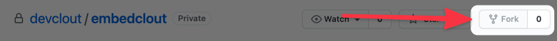
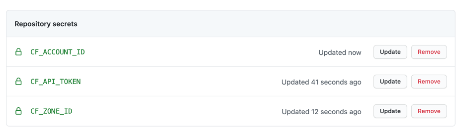
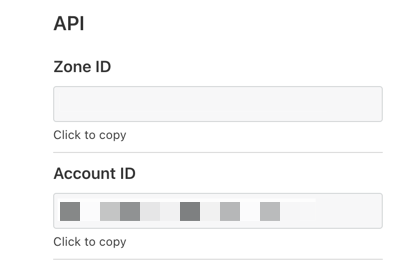
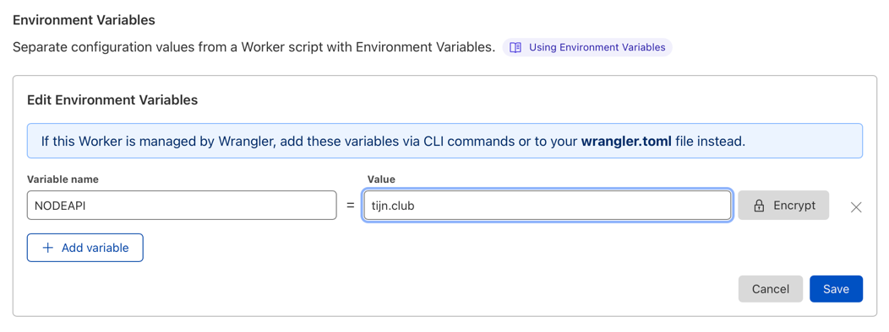
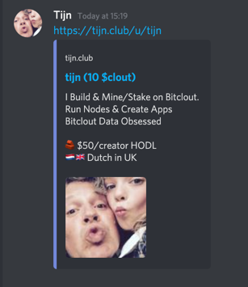

# EmbeDeSo

Easy Cloudflare Workers script that you can add to your DeSo Node domain to enable proper dynamic title and meta tags and with that get proper SEO content as well as URL embeds on all major platforms like Discord, Slack & Twitter.

[Read more about DeSo](https://deso.org) and [How to Run a Node](http://docs.deso.org/devs/running-a-node).

## Warning

Amending the index.js script and worker settings may impact the smooth running of your DeSo node frontend. 

Therefore I recommend you test this setup first on a subdomain of your node domain.

In addition be careful committing or merging changes to the worker/index.js script.

This repo includes a github action to enable easy updates of the installed cloudflare worker.

Lastly - you can only run 1 worker with the name `EmbeDeSo` in a single cloudflare account. So if you want to apply this to multiple node domains, you just need it ones and configure the routes on each of the domains that point to the worker.

## Dependencies

This script can only be used on Cloudflare workers.

This means your DeSo frontend node domain  has to be hosted on Cloudfare, and you have to have the workers service enabled.

With the default config, it also presumes the frontend and backend are both hosted on the same node. This script will make requests to your node api to get the required information for the html head.

You dont need Workers Unbound for this script. 

If your node gets less then 100k visits a day, you can probably run this on the FREE tier. 

If you have more visits, then for $5 / month your Bundled Workers plan can support upto 10m requests per month. Every additional million costs $0.50 ... just like the first DeSo ever minted!

[More detail on pricing is here.](https://developers.cloudflare.com/workers/platform/pricing)

## Checklist before starting

Please make sure you have done the following:

- ✅ You have a CloudFlare account and you are logged in
- ✅ Your domain is [added to your Cloudflare account](https://support.cloudflare.com/hc/en-us/articles/360000841472)
- ✅ Your node is setup on the domain
- ✅ Your Cloudflare account is [setup up for Workers](https://dash.cloudflare.com/sign-up/workers)


## Install this on your DeSo Domain

Follow the steps below to setup this DeSo embed script on your cloudflare workers and your DeSo domain.

### Step 1. Fork this repo

Go to the [EmbeDeSo github repo](https://github.com/DeSoDev/EmbeDeSo), and fork it.



### Step 2. Setup Your Github Secrets

Open the repo `Settings` area in a new browser tab, and then select `Secrets` in the sidebar.

As you will be skipping between this guide here, and your secrets settings its best to use a 2nd browser tab.

Add the following repo secrets -  using Step 3 and 4 below.

* `CF_ZONE_ID`: The ID of the Cloudflare zone for your bitclout domain
* `CF_ACCOUNT_ID`: Your Cloudflare Account ID
* `CF_API_TOKEN`: Create a API token

After adding the 3 secrets & the values from the previous steps, it should look like this:




### Step 3. Get your Account & Zone ID

* Go to your [Cloudflare Dashboard](https://dash.cloudflare.com/)
* Select the relevant account 
* Select the domain
* Scroll down in the right sidebar until you see the API section



### Step 4. Setup your API key

I recommend you setup a dedicated Cloudflare api token to allow github to deploy the worker script to the specific zone only.

* [Go to the API Tokens section on Cloudflare](https://dash.cloudflare.com/profile/api-tokens)

* Click 'Create Token'.

* Click `Use Template` for the `Edit Cloudflare Workers` row

* Click the edit button next to `token name` and enter a clear title, eg "EmbeDeSo Github Action"

* Leave the permissions as is

* Under `Account resources` select the account you are deploying this worker on

* Under `Zone resources` set it to `specific zone` and select your DeSo node domain in the dropdown.

* Click `continue to summary`

* Click `Create Token`

* Copy & safely store the token in your password manager


### Step 5. Deploy

To deploy the worker script to cloudflare:

* Go to the Gitup `Actions` tab for the forked repo.
* As you forked the repo, accept use of Actions
* Click the `Deploy` workflow.
* Click the `Run workflow` button on the right
* Wait for it to complete
* If everything has gone ok it should show a green checkmark besides the workflow run


### Step 6. Check the worker is setup

Go to the workers section for your account.

It should show the `EmbeDeso` worker.

It should also have been deployed on the workers.dev route - but this wont actually do anything besides helping you debug issues.

The reason for this is that the script needs to fetch the html from the node origin.

The script therefore includes a check to define a custom hostname to replace the worker domain with, and it will just output JSON from the workers.dev domain.

**Is your frontend domain is different then your api domain?**

You will need to go to the worker settings tab, and add an `NODEAPI` environment variable:



Note if deploying with wrangler or the included github action, the Environment variables will be reset to those listed in the wrangler.toml file. I recommend adding the following to wrangler.toml file to keep routes & env variables consistent:

```toml
account_id="your cf account id"
routes = ["yourdomain.com/u/*","yourdomain.com/posts/*","yourdomain.com/nft/*"]

[vars]
NODEAPI="your.api.node.com"
```

### Step 7. Setup the worker routes for your domain

Go to  your domain dashboard on cloudflare.

Click the workers tab.

Setup the following 3 routes:

1. the User route: `example.com/u/*` and `EmbeDeSo` as the worker.
2. the Posts route: `example.com/posts/*` and `EmbeDeSo` as the worker.
3. the Nft route: `example.com/nft/*` and `EmbeDeSo` as the worker.

Of course here you use your actual domain rather then `example.com`.

### Step 8. Update your node index.html file to include some meta tags

Your DeSo front end should already include the required html tags. But if you are running with a custom front end, or want to use this script on a different frontend then the reference DeSo one, then make sure these tags exist in the head section:

* title
* meta name description
* meta name twitter:image
* meta property og:title
* meta property og:description
* meta property og:site_name
* meta property og:image

You can add default descriptions, titles and sitenames if you want.

### Step 9. Test

Go to a discord channel and test a few embeds to make sure its working.



Also browse your node with a few posts and users to make sure all is fine there too.

### Step 10. Disable the worker.dev domain

Click the `EmbeDeSo` worker link on your domain worker dashboard.

Disable the Workers.dev route as you wont need it.


## Further improvements

Here are some TODOs that you may want to work on.

* [X] Add support for NFT urls

* [X] Improve embedding of image posts.

* [ ] Support oembed discovery URLs - most of the code for it is there but needs to be updated to support the `url` querystring param

* [ ] Filter traffic based on useragent and only run the worker api requests for known embed sources like discord, twitter, slack and search engine spiders.

* [ ] Add caching or KV store for API responses to reduce load on API and increase speed further.

* [ ] Add build script to minifi index.js